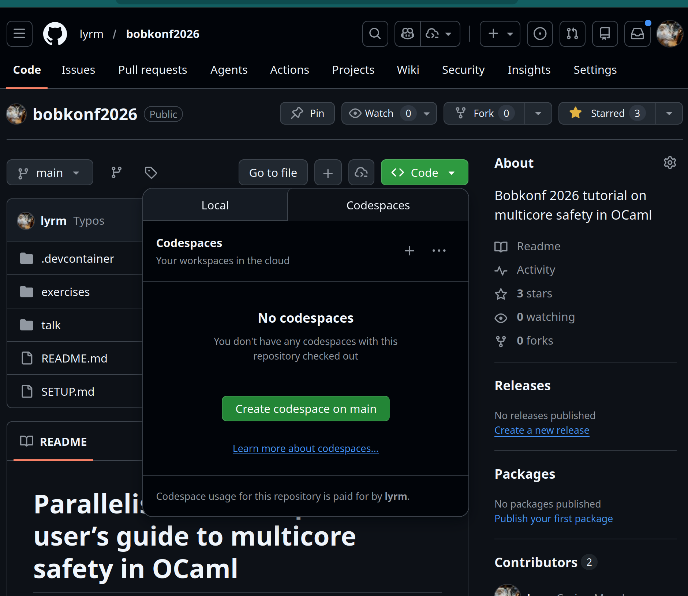

<!-- slipshow serve -o presentation/presentation.html presentation/presentation.md -->

{#beginning}

{height=60px}

<h1 style="text-align: center;">Parallelism without panic: </h1>
<h2 style="margin-top: -15px; text-align: center">A user’s guide to multicore safety in OCaml</h2>

<div style="text-align: center; margin-top: 1em;">
<p><strong>Carine Morel</strong> — with <strong>Sudha Parimala</strong> & <strong>Cuihtlauac Alvarado</strong></p>
<p style="font-size: 0.8em; color: #666;">

{height=30px}

</p>
</div>

{unreveal="ocaml-mc ocaml-pre ocaml-q req-intro req-list req-but cont-practice cont-list obj compl ex1 ex2 data-race race-cond"}

{pause up}

# Setup
{style="display: flex; gap: 2rem; align-items: flex-start;"}
---
>
> Setup instructions can be found here:
> ```shell
> https://github.com/lyrm/bobkonf2026
> ```
>
> **Locally (devcontainer in VScode): 10-15 minutes**
>
> Clone:
>
> ```shell
> git clone git@github.com:lyrm/bobkonf2026.git
> ```
>
> The README contains the setup instructions.
>
> If you cloned it sooner this week, make sure to pull the latest changes!

> **Github codespace: 5 minutes**
>
> {height=500px}
---

<div style="background: #fff3e0; border: 1px solid #e65100; border-radius: 5px; padding: 0.5em 1em; margin-top: 0.5em;">

⚠️ **3 devcontainers available:**

- [**ocaml**]{style="color: green"} (recommended): for codespace
- [**ocaml and ocaml+tsan**]{style="color: orange"}: local devcontainer
- [**oxcaml**]{style="color: purple"}: for the curious one. Not use during the tutorial.

</div>

{pause up}
<div style="background: #e8f4fd; border: 1px solid #4a90d9; border-radius: 5px; padding: 0.4em 1em; font-size: 1em; text-align: center; margin-top: 1em;">
📋 <strong>Setup</strong>: <code>git clone git@github.com:lyrm/bobkonf2026.git</code>. Full setup instructions in the README.  </a>
</div>


{carousel #intro-carousel}
> > ## {height=40px}
> > - Functional-first but multi-paradigm (supports imperative and object-oriented styles)
> > - Static type system with Hindley–Milner type inference
> > - Advanced features: powerful module system, GADTs, polymorphic variants
> > - [Since December 2022 (OCaml 5): Multicore support and effect handlers]{#ocaml-mc}
> >
> > > {#ocaml-pre}
> > > > **Before OCaml 5**: most bugs are caught at compile time,
> > > >
> > > > **Since OCaml 5**: some bugs can only be caught at runtime (e.g. race conditions, etc.)
> >
> > > {#ocaml-q}
> > > > - No way to check for it statically ?
> > > > - Otherwise, what tools to compensate for the lack of static guarantees ?
>
> > ## Requirements
> >
> > > {#req-intro}
> > > > We are going to explore [*multicore programming*]{style="color:blue"} issues in [*OCaml*]{style="color:orange"} in 1h30 so ...
> >
> > > {#req-list}
> > > > - being familial with [*OCaml*]{style="color:orange"} will help
> > > > - as well as knowing a bit about [*multicore programming*]{style="color:blue"}
> >
> > > {#req-but}
> > > > But:
> > > > - Most concepts will be shortly explain as we go,
> > > > - Most of the exercises don't require to write more than a few lines of code,
> > > > - And we will be here to help you if you get stuck!
>
> > ## Contents
> >
> > **Objective:**  Learn how to find, reproduce, and fix concurrency bugs in OCaml using dedicated testing tools.
> >
> > > {#cont-practice}
> > >  **In practice:** We add a `size` function to a lock-free Treiber stack and deliberately fall into every trap along the way.
> >
> > > {#cont-list}
> > > 1. 🎓 The Treiber stack & a first buggy `size` function
> > > 2. 🕳️ **Exercise 1**: Fall into a data race, climb out with unit tests + TSan
> > > 3. 🎓 Data races & race conditions
> > > 4. 🕳️ **Exercise 2**: Fall into a race condition on atomics, climb out with qcheck-lin + dscheck
> > > 5. 🧰 **Bonus**: OxCaml, never fall again (statically prevent data races)

{pause reveal="ocaml-mc"}

{pause reveal="ocaml-pre"}

{pause reveal="ocaml-q"}

{change-page=intro-carousel}

{pause reveal="req-intro"}

{pause reveal="req-list"}

{pause reveal="req-but"}

{change-page=intro-carousel}

{pause reveal="cont-practice"}

{pause reveal="cont-list"}

{pause up}
<div style="background: #e8f4fd; border: 1px solid #4a90d9; border-radius: 5px; padding: 0.4em 1em; font-size: 1em; text-align: center; margin-top: 1em;">
📋 <strong>Setup</strong>: <code>git clone git@github.com:lyrm/bobkonf2026.git</code>. Full setup instructions in the README. 
</div>

<!-- ## Lock-free stack  -->

{include src=1-treiber.md}

{pause up-at-unpause=part2}
## Race conditions and data races {#part2}

{style="display: flex; gap: 1rem; position:relative"}
> {slip}
> > {include src=2-race-conditions.md}
> 
> {slip}
> > {include src=2-data-races.md}

{pause up-at-unpause=part2}

{pause up}
{include src=2-concl-ex1.md}

{pause up}
### Second pitfall: atomic size field

{.columns-2b #phases}
---

{include src=2-atomic-implem.md}


> > 
> {.block .box reveal #ex2}
> > 📝 Exercise 2: race conditions on atomic operations
> > - A new implementation with an atomic size field
> > - Check the previous bug is gone with TSan
> > - Find a test that fails with `qcheck-lin`
> > - Find a trace of the bug with a model checker (`dscheck`) 
>

---

{pause up}
{include src=2-concl-ex2.md}


{pause up-at-unpause=part3}
## Conclusion on multicore-safety in OCaml {#part3}
{include src=3-conclusion.md}

{pause up-at-unpause=part4}
## OxCaml {#part4}

{include src=4-oxcaml.md}
